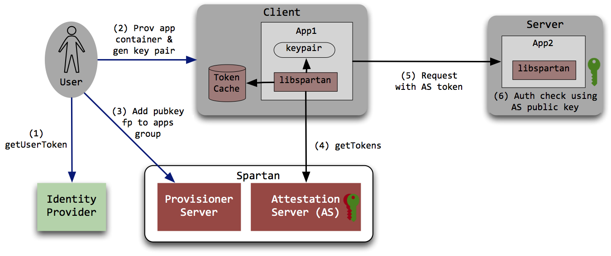

# Spartan 
**A Scalable Client Authentication & Authorization System for Container-based Environments**

**[Alpha release, not production ready]**

## Background
Container technologies are revolutionizing the way we develop, build and deploy applications in large scale production environments. Applications running in containers often need to connect to various internal/external services that require authentication and authorization. Authenticating client application to a server is a challenge in such dynamic environments because we cannot rely on traditional IP or hostname based checks. IP based authentication no longer works because (1) container IP is dynamic and often repurposed (2) containers often share IPs. Alternate options include the use of TLS client certs and other key based authentication schemes. TLS client certificates provide authentication, but not authorization capabilities by its own and is not easy to configure and operate at scale - think about CICD pipeline spawning hundreds of containers that live only for few minutes!

## What is spartan
Spartan is a role based identity system that provides both authentication and authorization to clients in an automated, easy to configure, scalable fashion. The system comprises of 

* Command line tools and APIs for node and application provisioners to manage and publish public key fingerprints
* Provisioner service that provides grouping of public key fingerprints of nodes/applications to roles that represents a capability
* Attestation service for the nodes & applications to get a signed tokens on demand that asserts the requested node's role membership. 

Your server application (service provider) maps the role with service specific capabilities and the requests are validated against the auth tokens placed by the client while making requests to the server. The system is designed from ground up based on our experience with an existing IP based authorization system, keeping practicality, flexibility and security in mind. The implementation makes use of modern security and crypto practices and such as ECDSA and JWT.

### Is spartan a replacement for TLS in my application ?
Spartan is complimentary to TLS. Spartan's primary goal is to enable client authentication and authorization capabilities. However it can provide mutual authentication as well. TLS is recommended for server authentication and transport security. TLS for client authentication is possible but is hard to operationalize at scale, especially in dynamic environments. Authorization capabilities in TLS certificates is also limited, if not impossible. Spartan is light weight form of PKI that provides identity, authentication and authorization capabilities. Transport security is also possible with ECDHE key exchange.

## Is this something for me?
Spartan would be useful if you have experienced any of the following problems:

* Enable fine granular access control for your application
* You have a HTTPS service, but want to enable client authentication and authrorization capabilities
* You are using client IP whitelists for access control, but find it less effective on shared IP environments like containers, NATs etc.
* Spartan as an alternate to manual client IP whitelisting technique

## Features

* Based on open standards - JSON Web Tokens, OpenID Connect, ECDSA etc.
* Easy to deploy and use
* Easy to integrate with corp identity systems
* Applications can authentice over non-secure network (HTTP)
* Extend to fit your requirements. For example, you may write a reverse and forward proxy spartan plugins
* Protection against replay attacks and scoped capabilities

## Getting Started
Please refer to [Getting Started Guide][]

## Language Bindings
Following are the Spartan API language bindings.
APIs are available to

1. Get tokens from attestation service (typically needed on your client application)
2. Validate tokens received in the request(typically needed on your server which accepts requests)

* [Go](https://github.com/yahoo/spartan-go)
* [Node.JS](https://github.com/yahoo/spartan-node)

[Getting Started Guide]: doc/getting-started.markdown

## Acknowledgements
Yahoo Paranoids team
